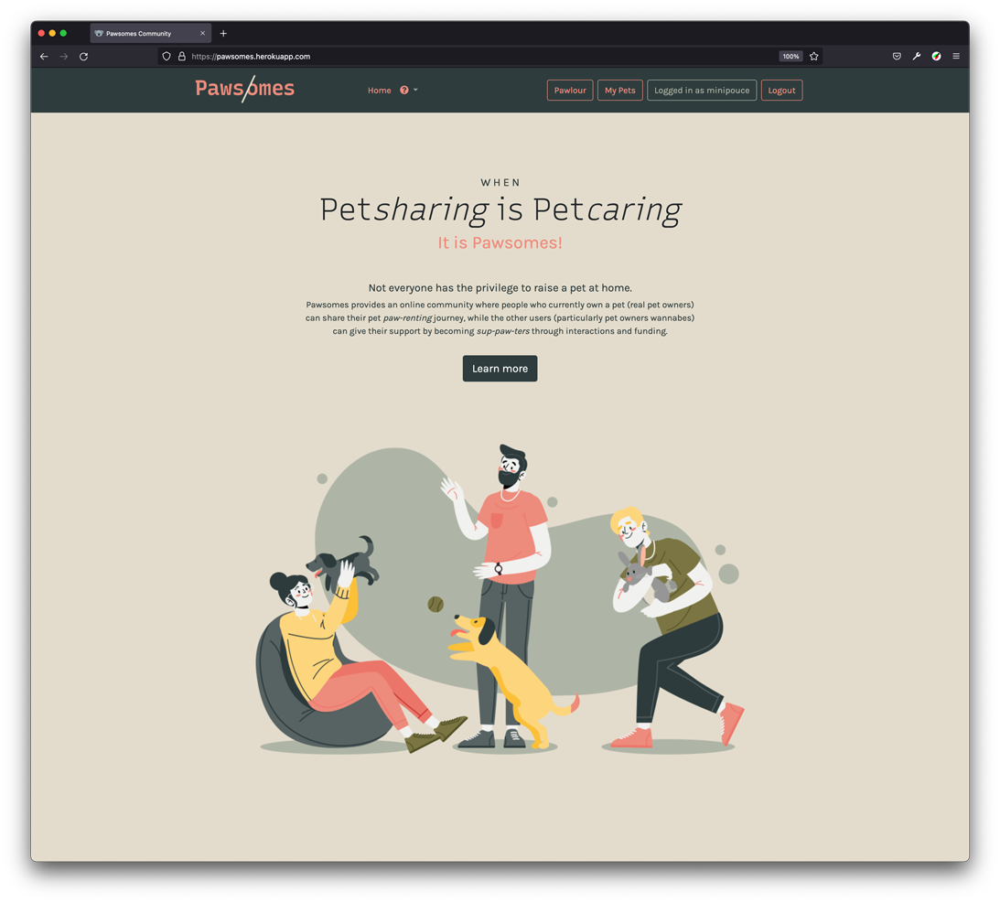
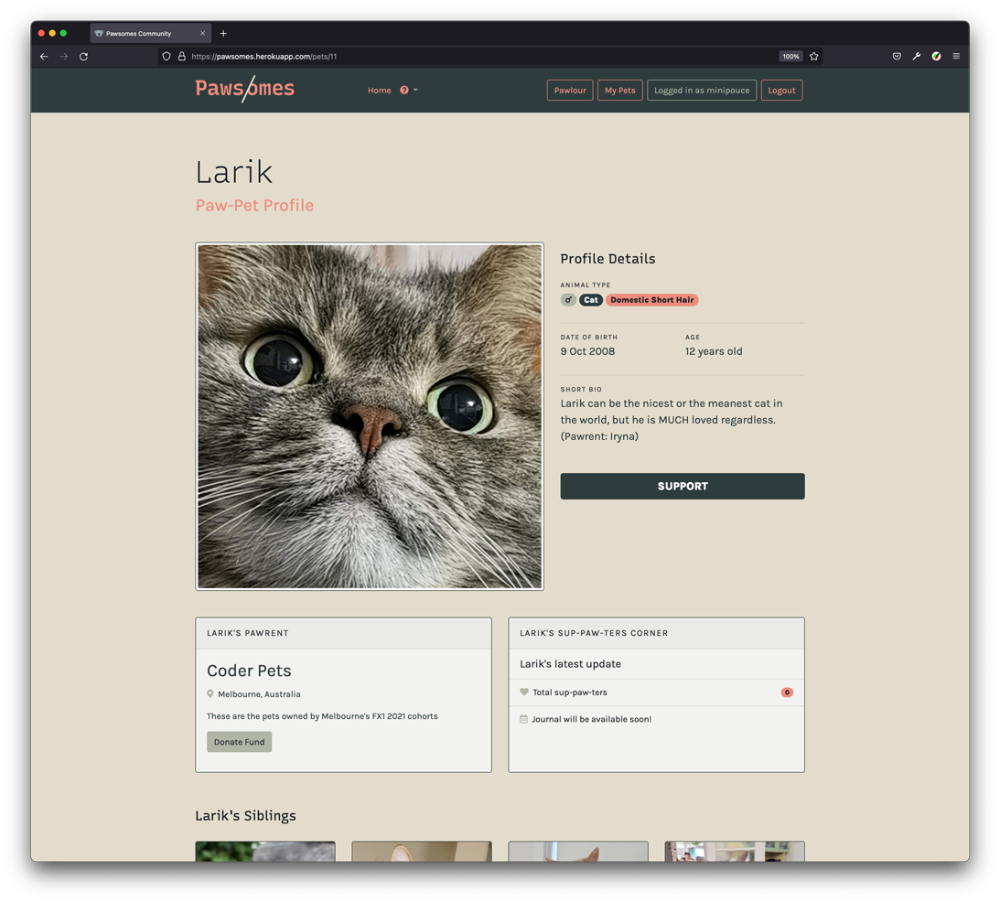
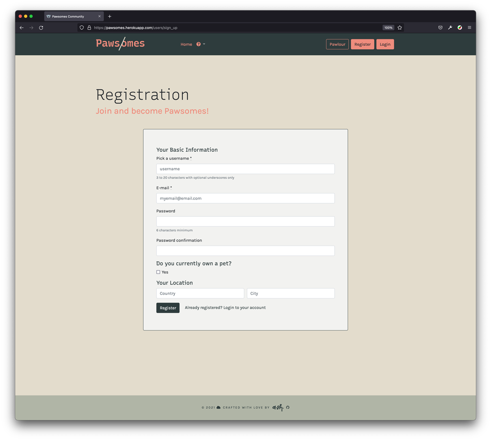

# *Pawsomes* – Rails Marketplace

***Also known as Angie SH*** 

# URLs 

A link to the GitHub repo

```
https://github.com/a-sh-dev/rails_pawsomes
```

Deployed Heroku link URL

```
https://pawsomes.herokuapp.com/
```

   

More screenshots coming  ↓  

# Project Details

## Defining the Problem

The study suggests that viewing cat videos and looking at animal images can significantly reduce stress and anxiety while also making you happier. Thanks to all of these adorable pet images and videos, many have a strong urge to get a pet of their own! Unfortunately, due to their particular circumstances, not everyone can have a pet. Raising a pet may, without a question, be rather costly! 

Pawsomes is an online community platform that caters to two types of people: pet owners and pet owners-to-be. Its slogan is, "when pet-sharing is pet-caring". Real pet owners can 'share' their journey being a '*pawrent'* through pet journaling with photos (like a blog). Other users (the pet owners wannabe) can become '*suppawters'* through supporting funds. In short, Pawsomes is when Instagram meets Patreon. At the same time, Pawsomes can also reduce stress from the overwhelming social media content as well as distractions from being consumed with it. Moreover, this community is also intended for anyone who doesn't own any social media accounts, or who seeks to reduce stress from the overwhelming social media content as well as distractions from being overly consumed with it! 

## Purpose

- An alternative to Instagram for people who don't use social media
- Provides interactions between users such as support through donations
- Gain more followers and supporters for existing Instagram accounts for their pets
- As a means to reduce stress from the overwhelming social media content and distraction of being consumed with it by limiting to animal posts.

## Functionality & Features

It's like an alternative to Instagram for people who don't use social media, as well as for existing social media accounts to share their profiles for those who do use social media.

On registration, users will be divided into two major types: pet owners, and regular users who currently do not own a pet.

- Pet owners can have more than 1 pet and the individual pet has their own profile page that can only be viewed by registered users
- Pawlour – is the Pets index, where all the current added pets can be viewed
- Any registered users (except the pet owner) can become a pet's 'sup-paw-ter' by clicking the 'support' button
- (Future release) Pet Journal is only postable by pet owners and viewable by the pet supporters. Journal must have photo attachment at least one.
- Fund payment – via PayPal.me external link that will be set up by the user through simple instructions

# User stories


- As a **pet owner**, Jenna takes a lot of photos of Maxie her Persian cat and has found that her friends love seeing the photos when she posted them on her private Instagram account. She wants to keep her Instagram account private and opening a new account exclusively for Maxie is quite overwheling for Jenna. She needs an online platform where she could show the world how beautiful Maxie is!
- As a **pet owner**, Piper lost her dear dog, Darling, a few years ago. She has found it hard to get a new dog to replace Darling. She doesn't use Instagram or Facebook or any other social media. Piper has benefited from seeing photos or videos of other dogs from google searches and YouTube videos. She would love to get more interactions from just seeing generic photos on the web.
- As a **pet owner**, Leon is a high-school student and is inseparable from Kiko, his 11 years senior British shorthair cat. Kiko's health has been declining and Leon has been thinking to get some extra funds or help from other people to help him with any VET costs for Kiko.
- As a **pet owner** who owns Cha-cha, Stef's tabby cat is a popular celeb-gram that has more than 5000 followers. She wants to gain more exposure and followers outside Instagram.
- As an **animal lover**, Ronald has always wanted to own a pet, not only it helps him to reduce anxiety and depression, but also for a companion. However, Ronald is unfortunately highly allergic to animals. He's seeking treatment for his allergies. In the meantime, he wants to get as much information as possible from real pet owners so one day hopefully he's prepared when he's able to raise one himself.

# Sitemap

   

# Wireframes

<details>
<summary>Expand to view Wireframes</summary>
<p>HOME</p>

<p>PET PROFILE</p>

<p>PET JOURNAL - HOME</p>

<p>PET JOURNAL - ADD POST </p>

<p>LOGIN / SIGN UP</p>

<p>PET PARLOUR (PETS INDEX)</p>

<p>MY PETS (FOR PET OWNERS & SUPPORTERS)</p>

<p>HOME (HIGH FIDELITY WIREFRAMES)</p>

</details>


# Final Deployed App Screenshots

   

↑  Home / Index

   

↑  About page

   

↑  Contact page

   

↑  Pawlour (Pets index)

   

↑  Pet profile

   

↑  Pet profile (continued)

   

↑  My Pets (regular user) – Only the Supported pets are displayed

   

↑  My Pets (owner), display both Pets owned and Supported pets

   

↑  User Registration

   

↑  User Account Page

# ERD – Entity Relationship Diagram

Initial ERD Plan  ↓

   

The ERD changed from the initial plan. Had a few issues with the database implementations along the way. 

# High Level Components (Abstractions)

## App core components

The app is built with Rails using the MVP (Model, View, Controller) framework. The Model is the database part where all the data is stored that is based on user's registrations, usually through forms. Controllers are like the brains, where all the logic to process the stored data reside. Controllers usually work together with routes to process the HTTP requests from users through methods creations, destroys, and edits. Finally, View is how all the controlled stored data is presented to users.

## User & Product concepts

The most prominent abstraction for the Pawsomes app is the User. It is intentional to have less private information collected from the User such as first and last name, address, etc for security reason. The main focus is the Pets. 

There are two kinds of users that can be registered, pet owners and regular users. Pet owners are the side of the marketplace that provide the 'pets' contents. Without the pet owners, there won't be any pets to be supported by the regular users. Pet owners are able to upload photos of their pet and add multiple pets and share their pet parenting journey. Regular users are able to 'support' the pet owners through donations and in the future implementations, through journal comments and possible in-app messaging feature. The need of an admin user or moderator is needed to be able to oversee everything as this is an open online community.

**Pets** are the main products of the Pawesomes app. The Pet model can be defined as the 'fattest' model for this app. Pawesomes app is an online platform or community which is also like a social media but with exclusive animal contents as its main purpose is to reduce stress and disctractions from the overwhelming social media content.

# Tech Stack & Third Party Services

## Core

- Built with Ruby 2.7.2
- Ruby on Rails 6.1.4
- PostgreSQL database

## Third Party Gems

- [**Devise**](https://github.com/heartcombo/devise) – for user account authentications and sensitive data protections
- [**Simple forms**](https://github.com/heartcombo/simple_form) – better form creation and management for Rails, integrated with Bootstrap

## Storage

- Amazon AWS S3 bucket storage

## Deployment & Host

- Heroku

## Front-End

- Bootstrap 4
- Font Awesome

# Project's Models & The Active Record Associations

## Location

- Location consists of three attributes of `country`, `state` and `city`
- Ideally, Location should be a join table of three seperate entities of Country, State, and City
- Location has many users
- <u>Note:</u> due to the initial plan to use `country_select` gem, the Location model was set this way, please see `known issues` for more information

## User

- User belongs to Location
- User is divided into two main registrable roles:
  - Pet owners
  - Regular users
- User who has the role of owner, has many Pets
- User (both owner and regular) has many supported Pets through Support join table.

## (Animal) Category

- Category has many breeds
- Category has many pets through Breed

## (Animal) Breed

- Breed belongs to Category
- Breed has many Pets

## Pet

- Pet belongs to one User (owner)
- Pet has one Breed and one Category through Breed
- Pet also has one attached profile photo through Active Records
- Pet has many Supports and many Supporters (Users)

# Implemented Database Relations

## Final ERD diagram


↑  The grey coloured entities are postponed features

Using a single User model, two different types or roles of Users can be created. A role attribute is used to enable the distinct roles. Throughout the Views configurations, User authorisations are made based on the roles to enable few features to be displayed by the help of Devise's `current_user` and `user_signed_in?` features. Through the Support join table, Pets can be supported and have many supporters, while Supporter (from User table) can support many Pets. 

# Database Schema Design

## Pawsomes `schema.rb`

Each table includes ` created_at :datetime`, `updated_at :datetime`, and `index` that wont be mentioned in the below schema design

```ruby
active storage attachments
	name: string
	record_type: string
	record_id: bigint
	blog_id: bigint, references

active storage blobs
	id: bigint, references
	filename: string
	content_type: string
	metadata: text
	service_name: string
	byte_size: bigint
	checksum: string

active storage variant records
	blob_id: bigint, reference
	variant_digest: string

breeds
	name: string
	category_id: bigint, references

categories
	name: string

locations
	country: string
	state: string
	city: string

pets
	owner_id: bigint, references, (class: User)
	breed_id: bigint, references
	name: string
	dob: date
	gender: integer
	bio: string
	instagram: string
	
supports
	supporter_id: bigint, references, (class: User)
	supported_pet_id: bigint, references, (class: Pet)

users
	email: string
	encrypted_password: string
	reset_password_token: string
	reset_password_sent_at: datetime
	remember_created_at: datetime

add_foreign_key "active_storage_attachments", "active_storage_blobs", column: "blob_id"
add_foreign_key "active_storage_variant_records", "active_storage_blobs", column: "blob_id"
add_foreign_key "breeds", "categories"
add_foreign_key "pets", "breeds"
add_foreign_key "pets", "users", column: "owner_id"
add_foreign_key "supports", "pets", column: "supported_pet_id"
add_foreign_key "supports", "users", column: "supporter_id"
add_foreign_key "users", "locations"
```

# Known Issues

- Issues with `Location` model. Initially planned to use `simple_form` benefit of `country_select` gem to have the `country`, `state`, and `city` to be pre-populated with Javascript so user can select instead of typing their location attributes. However, the intial implementation failed, so currently it duplicates the location ids when it matches existing ones. Perhaps a better future implementation would be having each country, state and city to have its own model, or implement Google's geolocation instead.
- Issues with `Support` controller and routes. On the Pet's profile or `show.html.erb`, the action to 'SUPPORT' and 'UNSUPPORT' pet have not been sucessfully implemented. Error with pet not found. I used this method from modifying an Instagram clone rails project that is 5-6 years old. Hope to be able to fix this in the future and implement my own methods to work.

# Future Improvements

Other than fixing the known issues, possible future improvements:

- Pet Journal & Comments, commentable by pet owner and other registered users. The journal can only be accessed by non-owner users if they `support` the pet. This journal is meant to be pictorial journal where the owner can post multiple pictures in a day with minimal captions as the emphasis is on the photos. 
- Journal posts likes, users are able to like or perhaps give 'paw', to the journal post and
- Notifications.
- Enable users to upload short videos within size limit.
- More Admin features to look after the community, such as tracking users and checking the credibility of the pet owners. Ensuring that all the funds to be donated to the pet owners go to the real pet owners, not fake accounts. Perhaps  there should be a function where Admin can first approve pet owners before they post any pets and ask for any funding. May involve cross-checking between submitted Instagram account and PayPal.me account. 
- Advanced Search pets feature.
- Paginations feature instead of infinite scrolling.

# Tasks Allocation – Project Management

Pawesomes project tasks are broken down and implemented with Trello board. Subtasks in each card are defined as checklists to help oversee and overview the scope of work. The projects are also broken into two main types: MVP and SPRINKLERS (or 'good to have, but not really necessary'). Honestly, it was quite hard to break down the tasks as I wasn't sure about the difficulty of the major tasks. Overall, Trello has significantly helped to plan and overview the project for better managements as well as giving a sense of acomplishments when you drag the tasks to the DONE sections.

## Screenshots


## Trello Board link:

```
https://trello.com/b/nZXThdTt
```

# Personal Reflection 

By far this is the most challenging assignment. It is a love and hate relationship for me between Database and Rails (*plus* Heroku!). Rails' convention over configuration is very powerful when the project is simple, yet when things get more complicated, advanced skills are needed!  I fell into another tutorial hell, believing that I couldn't proceed with the lack of knowledge I currently have and I'm still uncomfortable when facing so many 'errors'. However, indeed by actually doing it, I gain the learning as I go. There are so many things that I could learn, explore and implement by sticking to my initial plans. Yet, the lack of knowledge, practice and limited time constraints (plus personal circumstances) brought me down for this project. Anyway, it does give me a lot of insights into what the combination of back-end & front-end together is and I look forward to the agile collaborative teamwork in the real world. This project gives me a lot of learning curves through all the pain. Because of that, I can truly be satisfied when things (finally) work!

---

**As part of Coder Academy FX21-01 T2A2 Marketplace Assignment**

Crafted with ❤  by a-sh © 2021
